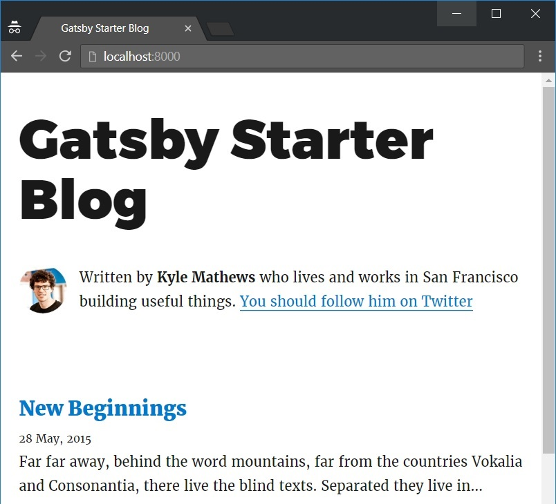
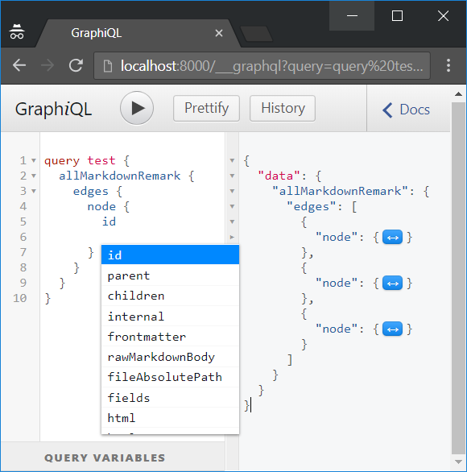

I recently found out about [GatsbyJS](https://www.gatsbyjs.org/ "GatsbyJS website") after they announced GatsbyJS V2 Beta. Having a blog and posting about stuff I work on has been on my to-do list for too long, so I decided to build my own blog using GatsbyJS! This first post is a step-by-step guide on how I built this blog using the v2 beta.
	
## GatsbyJS

GatsbyJS is a JavaScript web framework that lets you build fast websites and automatically optimizes them using modern web performance ideas (e.g. [PRPL Pattern](https://developers.google.com/web/fundamentals/performance/prpl-pattern/ "PRPL Google")).

GatsbyJS is really simple, the configuration is handled by the framework and the plugins. All you have to do is:
- Build your website using [React](https://reactjs.org/ "ReactJS website") components
- Pull your data from any source into your pages using [GraphQL](https://graphql.org/ "GraphQL website")
- Build an optimized website as static files ready to be deployed using the Gatsby CLI

You can find Gatsby's features in detail [here](https://www.gatsbyjs.org/features/ "GatsbyJS features"), compared to popular alternatives.

### Plugins

Plugins are Node.js packages that implement Gatsby APIs. They enable you to easily add features to your Gatsby app such as: setup Sass, adding Typescript, etc. 

GatsbyJS has a large set of plugins, take a look at the [Plugin Library](https://www.gatsbyjs.org/plugins/ "GatsbyJS plugin library"). 

### Starters

When creating a new site, you can optionally specify a starter to base your new site on.

There are 3 official starters and many others maintained by the community, you can find the list [here](https://next.gatsbyjs.org/docs/gatsby-starters/#gatsby-starters "GatsbyJS starters"). 

In this tutorial, we are going to use the `gatsby-starter-blog` official blog starter since it is already configured with all the necessary plugins to get your blog started.

### Markdown

This blogpost is a [Markdown](https://en.wikipedia.org/wiki/Markdown "Markdown wikipedia") file that has been transformed into a page programmatically. It looks like this:
```md
---
title: "How to create your blog using GatsbyJS (V2 Beta)"
date: "2018-07-21"
tags: ["GatsbyJS", "React", "GraphQL", "Markdown"]
---

I recently found out about GatsbyJS [...]
```
At the top of the file, we have YAML-formatted key value pairs that are relevant to the blogpost called **frontmatter**. The rest of the file is the content of the blogpost in Markdown format.

To make the transformation happen :

- We read files into GatsbyJS from the filesystem using the `gatsby-source-filesystem` plugin.
- We transform markdown to HTML and frontmatter to data using the `gatsby-transformer-remark` plugin.
- We programmatically create pages using Gatsby’s APIs

## Installation

Get Gatsby CLI

```
npm install --global gatsby-cli
```

Create your blog using the GatsbyJS V2 beta's official blog starter

``` 
gatsby new blog https://github.com/gatsbyjs/gatsby-starter-blog#v2
```

Navigate to your blog's folder

```
cd blog
```

And start a hot-reloading development environment accessible at localhost:8000

```
gatsby develop
```

We now have a simple yet functional blog running!



## App structure

Let's take a quick look at your app's structure which should look like this:

```js
src
  components      // Where React components will be
  pages           // Where pages will be
  templates       // Where page templates will be
  utils           // Classic utils folder
gatsby-config.js  // Gatsby's config file, plugins list
gatsby-node.js    // File where we programmatically create pages
```

## How to create pages
Pages can be created in many ways.

### Automatically creating pages

GatsbyJS core automatically turns React components in `src/pages` into pages:
```
pages/
  index.js
  404.js
```
... will become ...
```
my-website/
  index.html
  404.html
```

Let's take a look at `index.js` to understand how it works. 

```jsx
import React from 'react'
import { Link } from 'gatsby'
import get from 'lodash/get'
import Helmet from 'react-helmet'

import Bio from '../components/Bio'
import Layout from '../components/layout'
import { rhythm } from '../utils/typography'

class BlogIndex extends React.Component {
  render() {
    const siteTitle = get(this, 'props.data.site.siteMetadata.title')
    const posts = get(this, 'props.data.allMarkdownRemark.edges')

    return (
      <Layout location={this.props.location}>
        <Helmet title={siteTitle} />
        <Bio />
        {posts.map(({ node }) => {
          const title = get(node, 'frontmatter.title') || node.fields.slug
          return (
            <div key={node.fields.slug}>
              <h3
                style={{
                  marginBottom: rhythm(1 / 4),
                }}
              >
                <Link style={{ boxShadow: 'none' }} to={node.fields.slug}>
                  {title}
                </Link>
              </h3>
              <small>{node.frontmatter.date}</small>
              <p dangerouslySetInnerHTML={{ __html: node.excerpt }} />
            </div>
          )
        })}
      </Layout>
    )
  }
}

export default BlogIndex

export const pageQuery = graphql`
  query IndexQuery {
    site {
      siteMetadata {
        title
      }
    }
    allMarkdownRemark(sort: { fields: [frontmatter___date], order: DESC }) {
      edges {
        node {
          excerpt
          fields {
            slug
          }
          frontmatter {
            date(formatString: "DD MMMM, YYYY")
            title
          }
        }
      }
    }
  }
`

```

The index page queries markdown files and produces a list of blog post titles and excerpts. We can split the file in 2 parts:
- A React component rendering a layout, a bio and a list of blogposts using props.
- A GraphQL query, pulling the data page components need.

GraphQL is a query language similar to SQL. You describe the data you want in your component and then that data is given to you.
In Gatsby, the result of the query is automatically inserted into your React component on the `data` prop.

In the first part of the query, we're pulling the `siteMetadata`: 
```js
`
...
site {
  siteMetadata {
    title
  }
}
...
`
```
`site.siteMetadata` is common data we want to reuse across the app (like title or description) added to the `gatsby-config.js` file. It is automatically added to the GraphQL schema:
```js
module.exports = {
  siteMetadata: {
    title: 'Gatsby Starter Blog',
    author: 'Kyle Mathews',
    description: 'A starter blog demonstrating what Gatsby can do.',
    siteUrl: 'https://gatsbyjs.github.io/gatsby-starter-blog/',
  },
  plugins: [
    ...
  ]
```
The second part of the query pulls all the markdown files' (blogposts) title, date, slug and excerpt filtered by date:

```js
`
...
allMarkdownRemark(sort: { fields: [frontmatter___date], order: DESC }) {
  edges {
    node {
      excerpt
      fields {                    # fields created dynamically in gatsby-node.js
        slug
      }
      frontmatter {               # markdown file headers
        date(formatString: "DD MMMM, YYYY")
        title
      }
    }
  }
}
`
```

The `gatsby-transformer-remark` plugin parses each Markdown files into a **MarkdownRemark** node and also adds additional fields to the MarkdownRemark GraphQL including html, excerpt, etc.

There is an awesome tool you will need when building your GraphQL queries called `GraphiQL`. It is a powerful IDE that lets you "play" with GraphQL types and fields. You can press `CTRL+SPACE` to use the auto-complete feature.

GraphiQL is available on your development server at `http://localhost:8000/___graphql`:



If it's your first time seeing GraphQL, [this tutorial](https://graphql.org/learn/ "Learn GraphQL") is a good way to start.

### Programmatically creating pages

#### Page templates

To create pages programmatically, the first thing we need is a page template. Since we used the blog starter, we already a basic page template in the `src/templates` folder named `blog-post.js`.

```jsx
import React from 'react'
import Helmet from 'react-helmet'
import { Link } from 'gatsby'
import get from 'lodash/get'

import Bio from '../components/Bio'
import Layout from '../components/layout'
import { rhythm, scale } from '../utils/typography'

class BlogPostTemplate extends React.Component {
  render() {
    const post = this.props.data.markdownRemark
    const siteTitle = get(this.props, 'data.site.siteMetadata.title')
    const { previous, next } = this.props.pageContext

    return (
      <Layout location={this.props.location}>
        <Helmet title={`${post.frontmatter.title} | ${siteTitle}`} />
        <h1>{post.frontmatter.title}</h1>
        <p
          style={{
            ...scale(-1 / 5),
            display: 'block',
            marginBottom: rhythm(1),
            marginTop: rhythm(-1),
          }}
        >
          {post.frontmatter.date}
        </p>
        <div dangerouslySetInnerHTML={{ __html: post.html }} />
        <hr
          style={{
            marginBottom: rhythm(1),
          }}
        />
        <Bio />

        <ul
          style={{
            display: 'flex',
            flexWrap: 'wrap',
            justifyContent: 'space-between',
            listStyle: 'none',
            padding: 0,
          }}
        >
          {previous && (
            <li>
              <Link to={previous.fields.slug} rel="prev">
                ← {previous.frontmatter.title}
              </Link>
            </li>
          )}

          {next && (
            <li>
              <Link to={next.fields.slug} rel="next">
                {next.frontmatter.title} →
              </Link>
            </li>
          )}
        </ul>
      </Layout>
    )
  }
}

export default BlogPostTemplate

export const pageQuery = graphql`
  query BlogPostBySlug($slug: String!) {
    site {
      siteMetadata {
        title
        author
      }
    }
    markdownRemark(fields: { slug: { eq: $slug } }) {
      id
      html
      frontmatter {
        title
        date(formatString: "MMMM DD, YYYY")
      }
    }
  }
`

```

Like the JS files in `src/pages`, we have a React component and a GraphQL query pulling the data (HTML, frontmatter, siteMetadata) we need to render our page.

You may have noticed that we create 2 objects on line 14 using `this.props.pageContext`:

```jsx
const { previous, next } = this.props.pageContext

```

When dynamically creating pages using Gatsby APIs, we can pass additional data to templates via context. (see next block)

#### Create static pages

GatsbyJS exposes a powerful [Node.js API](https://www.gatsbyjs.org/docs/node-apis/ "Gatsby Node APIs"). This API is available in the gatsby-node.js file in the root directory of your project. Each export found in this file will be run by Gatsby.

In this case, we only care about the `createPages` and the `onCreateNode` APIs:

- `createPages` API, is called at build time with injected parameters `actions` and `graphql`.
- `onCreateNode` API, is called when a new node is created by a plugin with injected parameters `node`, `actions`, `getNode`.

Let's take a look at the `gatsby-node.js` file:

```js
const _ = require('lodash')
const Promise = require('bluebird')
const path = require('path')
const { createFilePath } = require('gatsby-source-filesystem')

exports.createPages = ({ graphql, actions }) => {
  const { createPage } = actions

  return new Promise((resolve, reject) => {
    const blogPost = path.resolve('./src/templates/blog-post.js')
    resolve(
      graphql(
        `
          {
            allMarkdownRemark(sort: { fields: [frontmatter___date], order: DESC }, limit: 1000) {
              edges {
                node {
                  fields {
                    slug
                  }
                  frontmatter {
                    title
                  }
                }
              }
            }
          }
        `
      ).then(result => {
        if (result.errors) {
          console.log(result.errors)
          reject(result.errors)
        }

        // Create blog posts pages.
        const posts = result.data.allMarkdownRemark.edges;

        _.each(posts, (post, index) => {
          const previous = index === posts.length - 1 ? null : posts[index + 1].node;
          const next = index === 0 ? null : posts[index - 1].node;

          createPage({
            path: post.node.fields.slug,
            component: blogPost,
            context: {                    //data passed to the template
              slug: post.node.fields.slug,
              previous,
              next,
            },
          })
        })
      })
    )
  })
}

exports.onCreateNode = ({ node, actions, getNode }) => {
  const { createNodeField } = actions

  if (node.internal.type === `MarkdownRemark`) {
    const value = createFilePath({ node, getNode })
    createNodeField({
      name: `slug`,
      node,
      value,
    })
  }
}
```

To create a page, we first need a **slug** (or path). We want to use each Markdown file name to create the page slug so `pages/hello-world/index.md` or `pages/hello-world.md` will become /hello-world/. 

The code inside `onCreateNode` creates a new field called `slug` everytime the `MarkdownRemark` plugin creates a node:
- We use the `createFilePath` function imported from the `gatsby-source-filesystem` plugin to create the slug.
- And then we use the `createNodeField` action to create the additional field.

The code inside `createPages` creates a new page for every Markdown files in `pages/`:
- We query Markdown files using the `graphql` injected param.
- And then we use the `createPage` action to create a page for each of the Markdown files using the `blog-post.js` template.

We now know how to create pages, let's add some style.

## Adding Style

When it comes to adding style, you have a lot of options:
- Classic: [Less](https://www.gatsbyjs.org/packages/gatsby-plugin-less/ "Less website") / [Sass](https://www.gatsbyjs.org/packages/gatsby-plugin-sass/ "Sass website")
- CSS-in-JS: [Glamor](https://www.gatsbyjs.org/docs/glamor/ "Glamor website") / [Styled Components](https://www.gatsbyjs.org/docs/styled-components/ "Styled Components website")
- [CSS Modules](https://www.gatsbyjs.org/tutorial/part-two/#css-modules "CSS Modules website")
- [Typography.js](https://github.com/kyleamathews/typography.js "Typography.js website")

In my case, I didn't want to add too much new stuff to my code and steepen my learning curve so I decided to stick with **Sass** and spice it up a little bit with **Typography.js**

### Typography.js

Typography.js is a JavaScript library which generates the base CSS for all your elements. It makes it easy to create a global custom and unique design to your project.
Typography also has more than 30 ready-to-use themes you can install as Node.js packages. You can play with them [here](http://kyleamathews.github.io/typography.js/ "Typography playground"). Using a theme you like as a base and overriding it is a good way to have a nice looking blog without much effort. 

That's exactly what's done in the Gatsby Blog Starter thanks to the Typography Gatsby Plugin already installed in `gatsby-config.js`:
```js
{
  resolve: 'gatsby-plugin-typography',
  options: {
    pathToConfigModule: 'src/utils/typography',
  },
}
```

If you take a look at the the `src/utils/typography.js` file, you will see that the `Typography` package and the `Wordpress2016` Typography theme package are imported and used:

```js
import Typography from 'typography'
import Wordpress2016 from 'typography-theme-wordpress-2016'

Wordpress2016.overrideThemeStyles = () => ({
  'a.gatsby-resp-image-link': {       // change rule on this selector
    boxShadow: 'none',            
  },
})

delete Wordpress2016.googleFonts      // delete theme fonts

const typography = new Typography(Wordpress2016)

// Hot reload typography in development.
if (process.env.NODE_ENV !== 'production') {
  typography.injectStyles()
}

export default typography
export const rhythm = typography.rhythm
export const scale = typography.scale
```

The `Wordpress2016` theme style is being overridden (see comments) and given as a parameter to Typography so it is applied globally.

In my case, I used the Github theme and changed the background color of the body and the font color of links and bold text:

```js
import Typography from 'typography'
import githubTheme from 'typography-theme-github'

githubTheme.overrideThemeStyles = () => ({
  'body': {
    background: "#fbfafc"
  },
  'a, strong': {
    color: "#fb1d1d"
  }
})

const typography = new Typography(githubTheme)

// Hot reload typography in development.
if (process.env.NODE_ENV !== 'production') {
  typography.injectStyles()
}

export default typography
```

### Setup Sass

To setup Sass, you only need to install the `gatsby-plugin-sass` and all the configuration will be handled by Gatsby.

Install the plugin
```bash
npm install --save gatsby-plugin-sass
```
Include the plugin in your gatsby-config.js file
```js
plugins: [
    [...],
    `gatsby-plugin-sass`
  ],
```

Now you can create `.scss` files and import them!

## Adding simple SEO

The final step is adding simple SEO to your blog using [React Helmet](https://github.com/nfl/react-helmet "React Helmet Github") and the [React Helmet Gatsby plugin](https://www.gatsbyjs.org/packages/gatsby-plugin-react-helmet/ "React Helmet Plugin"). The React Helmet package as well as the Gatsby plugin are already installed since we used the blog starter. 

To implement the basic SEO meta tags, I created a simple React component using props to render the tags:

```jsx
import React from 'react'
import Helmet from 'react-helmet'

class SEO extends React.Component {    
    render() {
      return (
      <Helmet>
        {/* General tags */}
        <title>{this.props.title}</title>
        <meta name="description" content={this.props.description} />
        <meta name="image" content={this.props.image} />
  
        {/* OpenGraph tags */}
        <meta property="og:url" content={this.props.url} />
        {this.props.isBlogpost ? <meta property="og:type" content="article" /> : null}
        <meta property="og:title" content={this.props.title} />
        <meta property="og:description" content={this.props.description} />
        <meta property="og:image" content={this.props.image} />
  
        {/* Twitter Card tags */}
        <meta name="twitter:card" content="summary_large_image" />
        <meta name="twitter:creator" content={this.props.twitter} />
        <meta name="twitter:title" content={this.props.title} />
        <meta name="twitter:description" content={this.props.description} />
        <meta name="twitter:image" content={this.props.image} />
      </Helmet>
    )
  }
}

export default SEO
```

And then imported the `SEO` component into my pages/templates (src/templates/blog-post.js):

```jsx
import React from 'react'
import SEO from '../utils/seo'

class BlogPostTemplate extends React.Component {
  render() {
    const post = this.props.data.markdownRemark
    const siteMeta = this.props.data.site.siteMetadata

    const indexSeo = {
      title: `${post.frontmatter.title} | ${siteMeta.title}`,
      description: post.excerpt,
      image: siteMeta.image,
      url: `${this.props.data.site.siteMetadata.siteUrl}${post.fields.slug}`,
      isBlogpost: true,
      twitter: siteMeta.twitter
    }

    return (
      <Layout location={this.props.location}>
        <SEO { ...indexSeo } />
        [...]
      </Layout>
    )
  }
}
```

The `siteMetadata` object inside the `gatsby-config.js` is good place to store all common data needed for SEO:

```js
module.exports = {
  siteMetadata: {
    title: 'Sevket Yalcin',
    author: 'Sevket Yalcin',
    description: 'Full Stack Web Developer who lives and works in Tokyo. I build stuff on my free time and blog about it here.',
    siteUrl: 'https://sevketyalcin.com',
    twitter: '@sev_yalcin',
    image: 'https://lh3.googleusercontent.com/NUDV52VqjIcOIFLdaP_pOfb2qfJ7TnaR8-ysRw-BX4Gs4LhLTsygGy0Vmb9mWIvFSsYSHj_BnIs',
  },
  plugins: [...]
}
```

You can then edit your GraphQL queries to pull those data (src/templates/blog-post.js):

```jsx
export const pageQuery = graphql`
  query BlogPostBySlug($slug: String!) {
    site {
      siteMetadata {
        title
        author
        title
        description
        image
        siteUrl
        twitter
      }
    }
    markdownRemark(fields: { slug: { eq: $slug } }) {
      id
      html
      excerpt
      fields {
        slug
      }
      frontmatter {
        title
        date(formatString: "MMMM DD, YYYY")
      }
    }
  }
`
```

## Conclusion

After running `gatsby build`, you will have a simple yet nice little static blog ready to be deployed inside the `public/` folder. I highly recommend [Netlify](https://www.netlify.com/ "Netlify website") as your static hosting platform. With Netlify, you can easily setup continuous integration from your Github repository!

GatsbyJS is really a powerful, magic framework. The GatsbyJS team and community is working every day to make it even easier to use with more and more features. I really enjoyed building this blog with GatsbyJS and will keep improving it. GatsbyJS is my go-to framework for static websites!

_Thank you for reading! This is my first blogpost ever, all your comments and suggestions are welcome!_